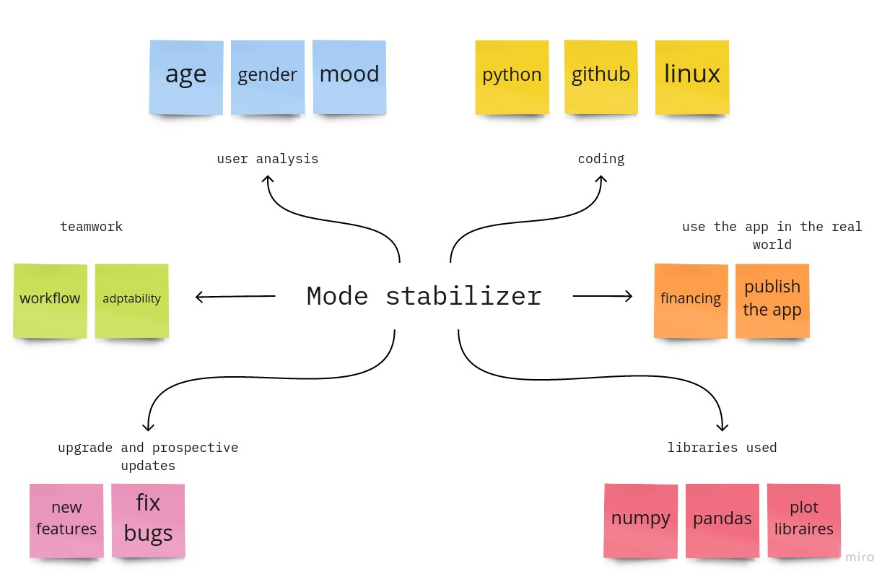

# Mood-Stabilizers
 

## Team Members :
1. Mohammad Noor Jebreen

2. Abdelmajed Alabed Alraheem

3. Ahmad Omar A. Shalein

4. laith fayiz abedelrahim hussein

5. yazan ahmad
   
 

## Wire frames

 

## User Stories:
    1. 
        1. Title => listening to music 
        2. User Story sentence => As a user, I want to  listen to music 
        3. Feature Tasks => Show more music
        4. Acceptance Test => Check the sound quality
    2. 
        Title => improve mood
        User Story sentence => As a user, I want an experience that makes my mood better
        Feature Tasks => Add songs to help raise the level of happiness
        Acceptance Test => Be careful not to give any song that might give the opposite effect
    3. 
        Title => Get to know my mood
        User Story sentence => As a user I want to know my mood
        Feature Tasks => Determine the current moods more quickly and accurately
        Acceptance Test => Make sure that the case identified is true
    4. 
        Title => Music according to mood
        User Story sentence => As a user, I want to listen to music that suits my mood
        Feature Tasks => Add additional music and more moods
        Acceptance Test => Make sure the music on display matches the mood

## [Software Requirements](requirements.md).
 
 

## Domain Modeling

## Database Schema Diagram

| modeId      | mode |
| ----------- | ----------- |
| id1      | mode1       |
| id2   | mode2        |

| songId      | song |frequency|
| ----------- | ----------- |-----|
| id1      | song1       |number1|
| id2   | song2        |number2|