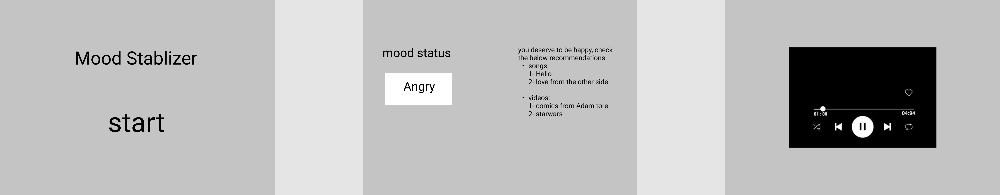
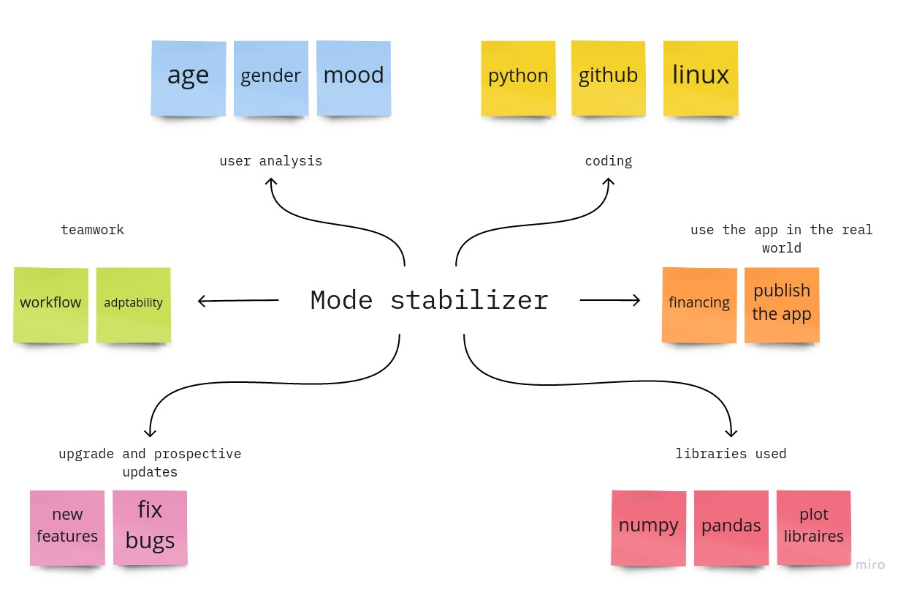

# Mood-Stabilizers

 

## Team Members

1. Mohammad Noor Jebreen

2. Abdelmajed Alabed Alraheem

3. Ahmad Omar A. Shalein

4. laith fayiz abedelrahim hussein

5. yazan ahmad

 

## summary:

### Our software acts as a mood detector, and we utilize machine learning to provide the user the choice to activate his camera, and the app will predict his mood and play a music appropriate for his/her mood. If the user does not open the cam, the user may also pick a mood from the list. The last option is to play the music list in shuffle mode.

## Project management tool

[GitHub Projects](https://github.com/orgs/Mood-Stabilizers-Application/projects/1)

 
 * the user stories are in the GitHub Projects tool

## Wire frames

[Figma Link](https://www.figma.com/file/0BOvMag0erdU0nF6Sy5yw0/Untitled?node-id=1%3A10)

 

## User Stories

 [user story](https://github.com/orgs/Mood-Stabilizers-Application/projects/1)

## [Software Requirements](docs/requirements.md)

 
 

## Domain Modeling

## Database Schema Diagram

| moodId      | mood |
| ----------- | ----------- |
| id1      | mood       |
| id2   | mood        |

| songId      | song |frequency|
| ----------- | ----------- |-----|
| id1      | song1       |number1|
| id2   | song2        |number2|

| pictureId      | picture |category|
| ----------- | ----------- |-----|
| id1      | Pic1       |Mood1|
| id2   | Pic2      |Mood1|
| id3  | Pic3     |Mood2|

## How to use the app

### How to run this Application

1. Download python from official site of python
2. for windows user press windows + x to open the power user menu click command prompt 
3. Run this command in the terminal: python MoodStablizer/first_page.py

### *Installation*

Install the following packages:

1. tkinter
2. pygame
3. tensorflow
4. PySimpleGUI
5. opencv-python
6. keras
7. datetime

collecting the data for machine learning:

1. Download FER 2013 Dataset using this link:
[FER2013](https://www.kaggle.com/msambare/fer2013/download)
2. run this command in the terminal : mkdir data
3. extract  the data inside folder data

### Run the tests

- Run the following command in the terminal : python3 -m pytest tests
- some tests don't work on github actions, because the github cant reach the device's hardware.